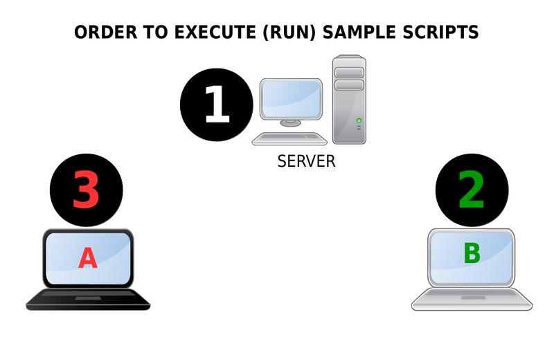

# WebRTC Easy and Power
**Web Real Time Communication - Easy and Powerful.**  
  
This sample intend to show WebRTC simplicity and powerfull mechanism.  
  
It uses NodeJS WebRTC and Simple-Peer Modules.  
  
The language of the scripts is JavaScript (NodeJS).  
  
My goal is to help common users to understand the basic of WebRTC, and start using it in, as much as possible, daily life stuff...  
  
  
First, let's do a little visual guide for the sample...  
  
Pict 1  
  
  
Pict 2  
  
  
Pict 3  
  
  
Pict 4  
  
  
Pict 5  
  
  
Pict 6  
  
  
Pict 7  
  
  
Pict 8  
  
  
Pict 9  
  

**How to:**  
0) Install the necessary software:  
```
npm install ws
npm install wrtc
npm install simple-peer
```
   
1) Download the .zip package and extract it  
  
2) Enter the directory:  
```
cd webRTC-easy-power   #Or, the name of the extracted folder...
```
  
3) run the server:  
```
node ws-server-v0.6.js   #Adjust for the correct version...
```
  
4) run the peer2 (B):  
```
node webRTC-sample-B-v0.6.js   #Adjust for the correct version...
```
  
5) run the peer1 (A):  
```
node webRTC-sample-A-v0.6.js
```
  
  
**Timming of the samples**  
For learning purposes, the samples uses the following time arrange.  
Second 1: exchange signals to connect  
Second 4: exchange messages  
Second 8: close connection(s)  
  
You can change the timming if you want.  
  
**Internet connection**  
You DO NOT NEED Internet connection, but, the computer need an IP ADDRESS otherwise the sample will not work properly...  
  
  
**2 Different Computers...IMPORTANT**  
You need to edit the scripts, and adjust the IP ADDRESS to reflect the ip addresses that you are running the server script!  
  
Take a look inside the code (all 3), all of them should point to the IP ADDRESS where the server-scripts is running.  
  
  
For RaspberryPI Zero, you need to compile Node-WRTC Module from source. [Instructions here...](https://github.com/t2age/webrtc-armv6)  
My advice is, test on x86 PC or RPI3 before trying on the Zero...  
    
  
**Here are the 3 small scripts**  
  
**ws-server-vN.js**  
```
const WebSocket = require('ws');
const WebSocketServer = WebSocket.Server;

const WEBSOCKET_PORT = 9000;

//const WEBSOCKET_ADDRESS = "localhost";				// all on same machine, this is also the "ws-server.js"
const WEBSOCKET_ADDRESS = "127.0.0.1";				// all on same machine, this is also the "ws-server.js"
//const WEBSOCKET_ADDRESS = "192.168.200.200";			// use 2 machines, IP of the "ws-server.js"

// Create a server for handling websocket calls
const myWebSock = new WebSocket.Server({ port: WEBSOCKET_PORT, host: WEBSOCKET_ADDRESS })

var currentWebSocket = 0;


myWebSock.on('connection', function(ws) {	
	console.log('WebSocket Connection ON...');
	const symbolKey = Reflect.ownKeys(ws._sender._socket).find(key => key.toString() === 'Symbol(asyncId)')

	currentWebSocket = ws._sender._socket[symbolKey];
	console.log("Connection from client " + currentWebSocket);
	console.log()
	
	ws.on('message', function(message) {
		const symbolKey = Reflect.ownKeys(ws._sender._socket).find(key => key.toString() === 'Symbol(asyncId)')
		currentWebSocket = ws._sender._socket[symbolKey];		
			
		console.log('--------------------------------------------');
		console.log("Received from client " + currentWebSocket);
		console.log('Received: %s', message);
		console.log('--------------------------------------------');
		
		// Send the received msg to the other peer...
		myWebSock.sendToPeer(message, currentWebSocket);
    
	});
});


myWebSock.sendToPeer = function(data, clientOrigemID) {
	console.log("clientID " + clientOrigemID);

	this.clients.forEach(function(client) {

		const symbolKey = Reflect.ownKeys(client._sender._socket).find(key => key.toString() === 'Symbol(asyncId)')
		var clientDestinationID = client._sender._socket[symbolKey];
				
		if (client.readyState === WebSocket.OPEN) {
			// Send the msg to the other peer...
			if (clientDestinationID !== clientOrigemID) {
				console.log("    Sending to client " + clientDestinationID);
				client.send(data);
			} else {
				// This is the same peer that send the msg...
				console.log("    No need to send back to itself...");
			}
		}
	});
};


console.log('--------------------------------------------');
console.log('Server running. ws://' + WEBSOCKET_ADDRESS + ':' + WEBSOCKET_PORT );
console.log('--------------------------------------------');
console.log();

```
